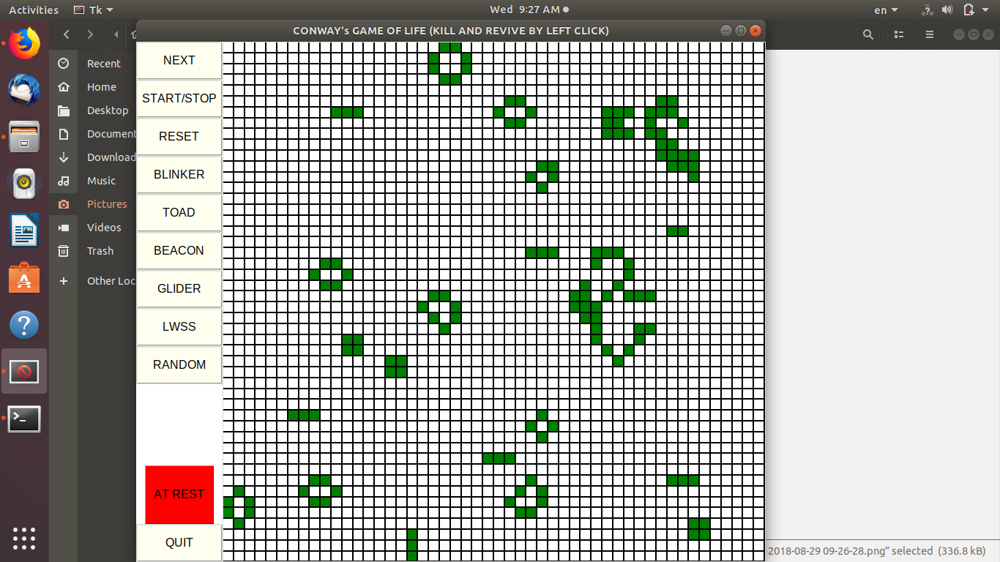

# conwayGameOfLife-python3Tkinter

*Notice that the code works in python3*

There are some controllers which provides you different well known oscillators and spaceship (e.g. Blinker, Glider), in addition there is a random buttom which provides a random pattern, a START/STOP button to start evolution, and a NEXT button to just go one step forward. 

